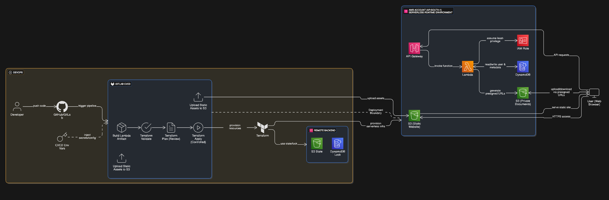

# 📦 DocVault — Secure Serverless Document Vault

DocVault is a fully serverless document management system built on AWS, designed with a **DevOps-first mindset**.  
The project emphasizes CI/CD-driven delivery, Infrastructure as Code, secure secret handling, and a clean separation between deployment-time and runtime concerns.

It demonstrates how to design, deploy, and operate a production-style serverless system without managing servers.

---

## 🏗 DevOps & System Architecture



The architecture highlights the **CI/CD and infrastructure workflow as the primary focus**, with the runtime serverless components shown at a high level to illustrate request flow, security boundaries, and managed AWS services.

### Key Design Principles

- CI/CD-driven infrastructure provisioning and deployment
- Terraform-based Infrastructure as Code with remote state and locking
- Clear deployment boundary between build-time and runtime
- Fully serverless runtime (no EC2 or container management)
- Least-privilege IAM access and secure secret injection

---

## 🔁 CI/CD & Delivery Pipeline

The system is deployed using **GitLab CI/CD**, following a controlled and reproducible workflow:

1. **Source Control**
   - Developer pushes code to Git (GitLab/GitHub)

2. **CI/CD Pipeline**
   - Build Lambda artifacts
   - Terraform validate
   - Terraform plan (review stage)
   - Terraform apply (controlled execution)
   - Sync static frontend assets to S3

3. **Infrastructure Provisioning**
   - Terraform provisions AWS resources
   - Remote backend uses S3 for state storage and DynamoDB for state locking
   - Environment-specific configuration injected via CI/CD variables

> Terraform state locking prevents concurrent applies and ensures safe collaboration.

---

## ☁️ Runtime Architecture (Serverless)

***Frontend***

- Static web application hosted on Amazon S3
- Accessed by users over HTTPS

***Backend***

- Amazon API Gateway routes API requests
- AWS Lambda handles authentication and business logic
- Lambda assumes a least-privilege IAM role

***Storage***

- Amazon DynamoDB stores user and metadata
- Private Amazon S3 bucket stores documents
- Presigned URLs enable direct client uploads/downloads without exposing the bucket

---

## 🔐 Security Highlights

- JWT-based authentication for user access
- Secrets injected via CI/CD environment variables (no secrets in code)
- IAM least-privilege roles for Lambda and CI/CD
- Private S3 buckets with controlled access via presigned URLs
- No long-lived credentials committed to source control

---

## ⚙️ Configuration & Variables

Infrastructure configuration is managed using Terraform variables.

Sensitive values are **required at runtime** and are provided securely via CI/CD:

- `TF_VAR_s3_bucket_name`
- `TF_VAR_dynamodb_table_name`
- `TF_VAR_JWT_SECRET_KEY`
- `TF_VAR_region`

Terraform automatically loads these values from the environment.

---

## 📂 Project Structure

```code
.
├── frontend/
│   └── public/
│       ├── index.html
│       ├── register.html
│       ├── dashboard.html
│       └── style.css
├── lambda/
│   ├── index.js
│   └── package.json
├── terraform/
│   ├── main.tf
│   ├── variables.tf
│   ├── outputs.tf
│   └── backend.tf
├── .gitlab-ci.yml
├── docs/
│   └── docvault-devops-architecture.png
└── README.md
```

---

## 🧭 Future Enhancements

- Password reset via email/OTP
- Secure file sharing between users
- File preview support
- CI/CD pipeline enhancements and automated tests
- Optional OIDC-based authentication for CI/CD → AWS access

---

## 📝 License

MIT License

---

## 👨‍💻 Author

Built by **Jay Patel**
